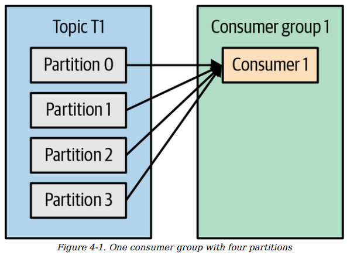
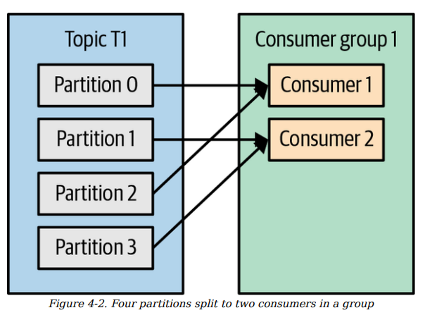
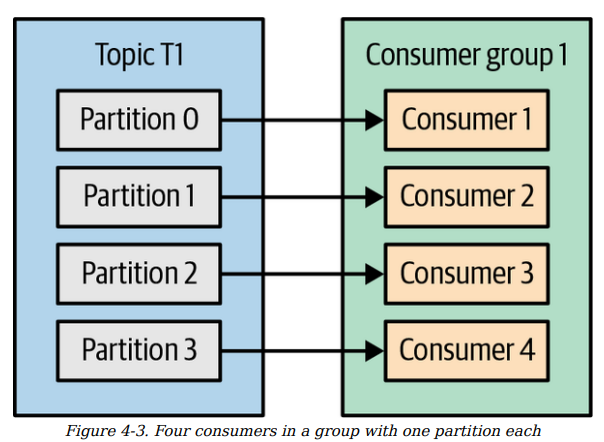
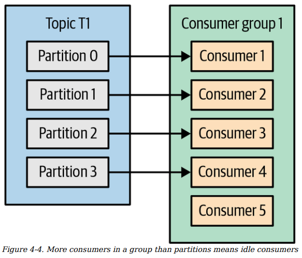
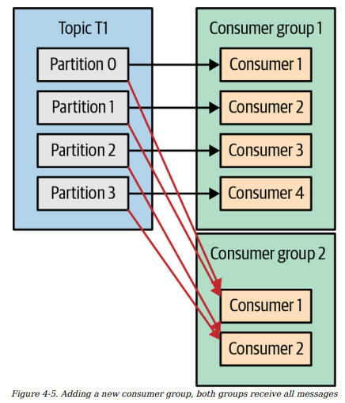
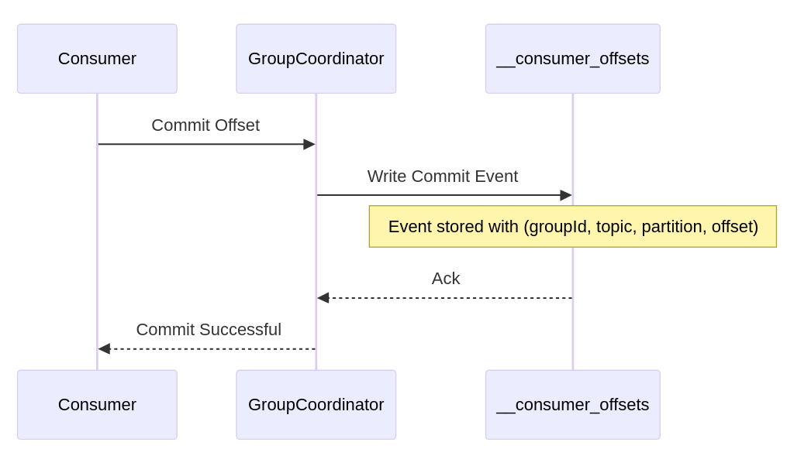

- `Consumer and Consumer Group`
    - one partittion is just only consumed by one consumer in a consumer group, 1 consumer can consume as much partition as possible (n -> 1)
        - Q: can a partition be consumed by many consumer ? 
        - A: Yes but in different consumer group (different group-id)(image 5)
    - Ex:
        
        

        

        

        

        

- `Partition Rebalance`
    - Moving partition ownership from one consumer to another
is called a `rebalance`
    - `When ?` (https://www.confluent.io/learn/kafka-rebalancing/#what-triggers-a-rebalance)
        - New Consumer Joins the Group
        - Existing Consumer Leaves the Group (or Fails, stop sending hearbeat)
        - Topic metadata change (new/delete partition) 
    - `Type of Rebalance` (https://rajeevranjan.dev/blog/kafka/kafka-eager-vs-cooperative-rebalancing/): 
        - Eager Rebalancing: Stop Everything 
        - Cooperative Rebalancing: Move Only What’s Necessary (Apache Kafka 2.4)
    - `How ?` (https://tomlee.co/2019/03/the-unofficial-kafka-rebalance-how-to/)
        - Why divide Group Leader, and GroupCoordinator ? 
        (https://stackoverflow.com/questions/42015158/what-is-the-difference-in-kafka-between-a-consumer-group-coordinator-and-a-consu)
        - related to partition.assigned.strategy 
        
- `Create Kafka Consumer` 
    - manually (books)
    - spring-kafka (https://www.confluent.io/learn/spring-boot-kafka/)

- `Pool Loop` 
    - thread per consumer (ConsumerService.java)

- `Configuring Consumer`

- `Commit and Offset`
    - (https://www.confluent.io/blog/guide-to-consumer-offsets/)
    - store commited offfset in internal topics `__consumer_offsets`
    ex: if consumer read offfset 25 then, commited 26 its `important` to know that it store `next commit offfset`
    - `autocommit`: auto commit the returned latest pool() loop interval (default 5s) 
        - config enable.auto.commit=true, auto.commit.interval.ms 
        - consumer crash 3s before commit the latest => after healing reprocessing the message 
        - consumer pool (1,2,3,4 message) -> after 5s commit message 5, but actuall processing 3 message, message 4 not handled actualy, crash ? 
        On the next pool loop after healing, message 4 will be never replay (5 6,7,8,...) 
        - So hard to manage the consistent offset, huh ? 
    - `sync commit`:
        - enable.auto.commit=false
        - Api commitSync(): commit the latest offset from pool() as default, So please attention to call that after all message consumed. Retry mechanism if failed
        - reprocessing cases still happened, less throughput, more lock ( wait for broker and replica return response) 
        - `commitSync retries` committing as long as there is no error
that can’t be recovered
    - `async commit`: (https://www.baeldung.com/kafka-commit-offsets)
        - in java use diffrent thread to not blocking and callback for logging if you want to know what happend :))  
        - async does not retry on case failure why, let ex case first commitAsync 1000 offset first then when commit the next 2000 offfset, it previous commit still in flight, current commit 2000 done and retries previous 1000 offset -> ?????
    - `combine async and sync commit`:
        ```java 
        Duration timeout = Duration.ofMillis(100);
        try {
            while (!closing) {
                ConsumerRecords<String, String> records = consumer.poll(timeout);
                for (ConsumerRecord<String, String> record : records) {
                    System.out.printf("topic = %s, partition = %s, offset = %d,
                    customer = %s, country = %s\n",
                    record.topic(), record.partition(),
                    record.offset(), record.key(), record.value());
                }
                consumer.commitAsync();
            }
                consumer.commitSync();
        } catch (Exception e) {
            log.error("Unexpected error", e);
        } finally {
            consumer.close();
        }
        ```
        - While everything is fine, we use commitAsync. It is faster, and if one commit fails, the next commit will serve as a retry

    - `commit specific offset`: 
        - 
    - how `kakfa` commit offset on diffrent group, is that same commit offset, actual no, offset key (group_id, next_offset, partition)
    - 

    - `Error Handler`:
        - dead letter queue kafka
- `Idempoteny Consumer`
    - using redis idempotent (but seem not scale as fuck), use db instead created process_table (https://www.conduktor.io/blog/building-idempotent-consumers)

