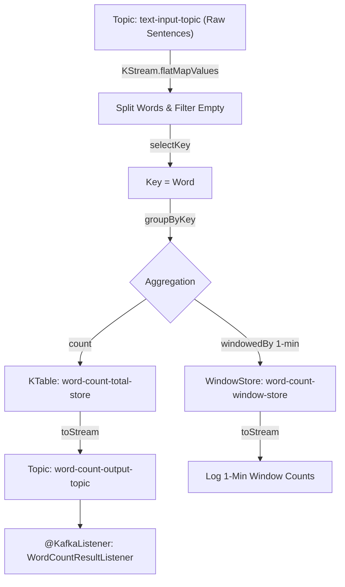

# Kafka Streams Architecture & Word Count Streaming Demo

Kafka Streams is a client library for building real-time, event-driven applications and microservices where input and output data are stored in Apache Kafka clusters.

---

## 1. Key Concepts & Architecture

### Core Abstractions: KStream vs KTable
- **`KStream` (Record Stream / Insert Stream)**:
  - Represents an unbounded stream of key-value pair records.
  - Every record is an append-only event (e.g., individual page views, sensor readings, raw text lines).
- **`KTable` (Changelog Stream / Upsert Stream)**:
  - Represents the current state of a dataset as key-value pairs.
  - Each record is an update (upsert). If a key already exists, its value is updated. A `null` value acts as a tombstone (deletion).
- **Stream-Table Duality**:
  - A `KStream` can be aggregated into a `KTable`.
  - A `KTable` can be converted back into a `KStream` (`kTable.toStream()`) emitting its state updates as events.

### Stateful Processing & State Stores
- Stateful transformations (`count()`, `aggregate()`, `reduce()`, `join()`) require storing intermediate state.
- Kafka Streams automatically manages local state stores backed by **RocksDB** (or in-memory) and maintains changelog topics on Kafka brokers for fault-tolerance.

### Windowing
- **Tumbling Window**: Fixed-size, non-overlapping time windows (e.g., 1-minute window).
- **Hopping Window**: Fixed-size, overlapping windows.
- **Sliding Window**: Defined by time differences between events.
- **Session Window**: Data aggregated into sessions separated by inactivity gaps.

---

## 2. Topology Design (Word Count Pipeline)



---

## 3. Spring Boot Implementation Overview

### 1. Configuration (`KafkaStreamsConfig.java`)
Annotated with `@EnableKafkaStreams`. Spring Boot automatically manages `StreamsBuilderFactoryBean` lifecycle and binds Kafka Streams properties.

```java
@Configuration
@EnableKafkaStreams
public class KafkaStreamsConfig {
    @Bean(name = KafkaStreamsDefaultConfiguration.DEFAULT_STREAMS_BUILDER_BEAN_NAME)
    public KafkaStreamsConfiguration kStreamsConfig() {
        Map<String, Object> props = new HashMap<>();
        props.put(StreamsConfig.APPLICATION_ID_CONFIG, "wordcount-streams-app");
        props.put(StreamsConfig.BOOTSTRAP_SERVERS_CONFIG, "localhost:9092,localhost:9093,localhost:9094");
        props.put(StreamsConfig.DEFAULT_KEY_SERDE_CLASS_CONFIG, Serdes.String().getClass().getName());
        props.put(StreamsConfig.DEFAULT_VALUE_SERDE_CLASS_CONFIG, Serdes.String().getClass().getName());
        props.put(StreamsConfig.STATE_DIR_CONFIG, "./data/kafka-streams");
        return new KafkaStreamsConfiguration(props);
    }
}
```

### 2. Stream Processing Pipeline (`WordCountStreamTopology.java`)

```java
@Component
public class WordCountStreamTopology {

    public static final String TEXT_INPUT_TOPIC = "text-input-topic";
    public static final String WORD_COUNT_OUTPUT_TOPIC = "word-count-output-topic";
    public static final String TOTAL_WORD_COUNT_STORE = "word-count-total-store";

    @Autowired
    public void buildPipeline(StreamsBuilder streamsBuilder) {
        KStream<String, String> textLines = streamsBuilder.stream(
                TEXT_INPUT_TOPIC,
                Consumed.with(Serdes.String(), Serdes.String())
        );

        KStream<String, String> words = textLines
                .flatMapValues(text -> Arrays.asList(text.toLowerCase().split("\\W+")))
                .filter((key, word) -> word != null && !word.trim().isEmpty())
                .selectKey((key, word) -> word);

        // Stateful KTable count
        KTable<String, Long> wordCounts = words
                .groupByKey(Grouped.with(Serdes.String(), Serdes.String()))
                .count(Materialized.<String, Long, KeyValueStore<Bytes, byte[]>>as(TOTAL_WORD_COUNT_STORE)
                        .withKeySerde(Serdes.String())
                        .withValueSerde(Serdes.Long()));

        wordCounts.toStream()
                .map((word, count) -> new KeyValue<>(word, word + ":" + count))
                .to(WORD_COUNT_OUTPUT_TOPIC, Produced.with(Serdes.String(), Serdes.String()));
    }
}
```

### 3. Interactive State Store Queries (`KafkaStreamingController.java`)
Allows querying local RocksDB state stores over HTTP without consuming from topic partitions.

```java
ReadOnlyKeyValueStore<String, Long> store = kafkaStreams.store(
    StoreQueryParameters.fromNameAndType(
        WordCountStreamTopology.TOTAL_WORD_COUNT_STORE,
        QueryableStoreTypes.keyValueStore()
    )
);
Long count = store.get("kafka");
```

---

## 4. How to Run & Verify Demo

### Step 1: Start Kafka Cluster
Ensure Kafka is running locally via Docker Compose:
```bash
docker compose up -d
```

### Step 2: Start Spring Boot Application
```bash
cd spring-kafka
mvn spring-boot:run
```
*(Runs on port `8081`)*

### Step 3: Ingest Text Streams for Processing
Send sentences to the input topic via REST API:

```bash
curl -X POST http://localhost:8081/api/kafka/streams/word-count/publish \
  -H "Content-Type: application/json" \
  -d '{"text":"Kafka streams processing real time text streams! Kafka streams is fast and powerful."}'
```

Response:
```json
{
  "status": "PUBLISHED",
  "topic": "text-input-topic",
  "text": "Kafka streams processing real time text streams! Kafka streams is fast and powerful.",
  "partition": 0,
  "offset": 0
}
```

### Step 4: Verify Real-Time Log Output
In the application console logs, you will observe:
1. `[STREAMS-INPUT] Raw line received: ...`
2. `[STREAMS-OUTPUT] Word='kafka' TotalCount=2`
3. `[STREAMS-WINDOW] Word='kafka' Window=[... - ...] Count=2`
4. `[WORD-COUNT-CONSUMER] Topic=word-count-output-topic Key='kafka' Value='kafka:2'`

### Step 5: Query Interactive State Store
Fetch all current aggregated word counts directly from the local RocksDB state store:

```bash
curl http://localhost:8081/api/kafka/streams/word-count/stats
```

Response:
```json
{
  "totalWordsTracked": 9,
  "wordCounts": {
    "and": 1,
    "fast": 1,
    "is": 1,
    "kafka": 2,
    "powerful": 1,
    "processing": 1,
    "real": 1,
    "streams": 3,
    "time": 1
  }
}
```

Query count for a specific word (e.g., `kafka`):
```bash
curl http://localhost:8081/api/kafka/streams/word-count/kafka
```

Response:
```json
{
  "word": "kafka",
  "count": 2,
  "found": true
}
```

# article
https://www.conduktor.io/glossary/introduction-to-kafka-streams 

# fraud detection 
- kafka easy, enrich with order 
https://medium.com/@bubu.tripathy/real-time-fraud-detection-with-kafka-streams-and-spring-boot-8f358e55e5c3
- blog of apply streamming machine learning to fraud detection
https://aioconquer.aivietnam.edu.vn/posts/cach-ngan-hang-dung-hoc-may-de-ngan-chan-nhung-gian-lan
https://viblo.asia/p/thiet-ke-he-thong-phat-hien-gian-lan-rule-based-fraud-detection-system-design-n1j4lxbd4wl
https://medium.com/@blakelassiter/designing-a-fraud-detection-system-from-requirements-to-architecture-d2225218e402
https://manishmazumder5.substack.com/p/real-time-fraud-detection-ml-system


# Stateful and Stateless Operation 
Stateless Operations:
- filter()
- map()
- flatMap()
- split().branch()

Stateful Operations:
- count()
- aggregate()
- reduce()
- join()
- windowedBy() 

## State store
Local State Stores:
- RocksDB (default) - persistent, disk-based
- In-Memory - faster, limited by memory

Changelog Topics:
- Automatically created for fault tolerance
- Replayed on restart to rebuild state

---

## 5. KStream vs KTable — Deep Comparison

### Core Semantics

| Aspect | **KStream** (Event Stream) | **KTable** (Changelog Stream) |
|---|---|---|
| **Record meaning** | Each record = **INSERT** (new event) | Each record = **UPSERT** (insert or update) |
| **Duplicate keys** | All kept — `alice:100, alice:200` = 2 records | Only latest — `alice:100, alice:200` → `alice:200` |
| **Analogy** | Bank statement (every transaction) | Account balance (current state) |
| **Stateful by itself?** | ❌ No — just a pipe, records flow through | ✅ Yes — always backed by RocksDB state store |
| **Backed by state store?** | No (unless aggregation is applied) | Yes (always) |
| **Null value** | Regular record with null value | **Tombstone** — deletes the key |

### Is KStream Stateful?

**KStream by itself is STATELESS** — it's just a pipe. Records flow through and nothing is stored.

```
KStream stateless operations (no storage):
  → peek(), filter(), map(), flatMap(), selectKey(), branch()
```

**BUT** KStream becomes stateful when you call aggregation operations — these internally create a KTable backed by a state store:

```
KStream stateful operations (creates state store):
  → groupByKey().count()       — state store holds counts
  → groupByKey().aggregate()   — state store holds aggregates
  → groupByKey().reduce()      — state store holds reductions
  → join(otherStream)          — state store holds join window
```

> **Key insight**: It's never the KStream itself that stores data — it's the **KTable produced by the aggregation**.

### Where State Stores Are Physically Stored

State stores live in **two places** for fault tolerance:

```
┌─────────────┐    write     ┌──────────────────────────────────┐
│  KTable     │ ──────────→  │  RocksDB (local disk)            │  fast reads/writes
│  (in-memory │              │  ./data/kafka-streams/            │
│   logic)    │              │  {app-id}/{partition}/            │
└─────────────┘              └──────────────────────────────────┘
      │
      │ also writes to (for fault tolerance)
      ▼
┌──────────────────────────────────────────────┐
│  Kafka Changelog Topic                       │
│  {app-id}-{store-name}-changelog             │
│  e.g. wordcount-streams-app-                 │
│       word-count-total-store-changelog        │
│                                              │
│  If app crashes → replays this topic         │
│  to rebuild the local RocksDB store          │
└──────────────────────────────────────────────┘
```

In this project:
- **Local RocksDB**: `./data/kafka-streams/wordcount-streams-app/` (configured via `state.dir` in `KafkaStreamsConfig.java`)
- **Changelog topic**: auto-created by Kafka Streams, e.g. `wordcount-streams-app-word-count-total-store-changelog`

### Example: Bank Balance (KStream vs KTable side by side)

Both read from the **same topic** `user-balance-topic` with messages `key=userId, value=balance`:

```java
// Read once as KStream
KStream<String, String> balanceStream = streamsBuilder.stream(
    "user-balance-topic", Consumed.with(Serdes.String(), Serdes.String()));

// Derive KTable from the same stream (can't register same topic twice)
KTable<String, String> balanceTable = balanceStream.toTable(
    Materialized.<String, String, KeyValueStore<Bytes, byte[]>>as("user-balance-store")
        .withKeySerde(Serdes.String())
        .withValueSerde(Serdes.String()));
```

After producing: `alice:100 → bob:50 → alice:200 → alice:150`

```
KStream sees ALL 4 events:              KTable keeps LATEST per key:
  alice → 100                             alice → 150  (updated 3 times)
  bob   → 50                              bob   → 50
  alice → 200
  alice → 150
```

### count() Behavior — The Critical Difference

```java
// KStream: counts every EVENT (insert semantics)
balanceStream.groupByKey().count()
// Result: alice=3, bob=1  (3 events for alice)

// KTable: counts unique KEYS (upsert semantics)
balanceTable.groupBy((k, v) -> KeyValue.pair(k, v)).count()
// Result: alice=1, bob=1  (alice is 1 key, no matter how many updates)
```

```
[KSTREAM-COUNT]  user='alice' eventCount=1
[KTABLE-COUNT]   user='alice' uniqueCount=1

[KSTREAM-COUNT]  user='bob'   eventCount=1
[KTABLE-COUNT]   user='bob'   uniqueCount=1

[KSTREAM-COUNT]  user='alice' eventCount=2    ← increments!
[KTABLE-COUNT]   user='alice' uniqueCount=1   ← stays 1!

[KSTREAM-COUNT]  user='alice' eventCount=3    ← increments again!
[KTABLE-COUNT]   user='alice' uniqueCount=1   ← still 1!
```

### Summary Table

| | **KStream** | **KTable** |
|---|---|---|
| **Storage** | ❌ None (stateless pipe) | ✅ RocksDB + changelog topic |
| **Becomes stateful** | Only with `count()/aggregate()/reduce()/join()` | Always stateful |
| **count() for alice (3 msgs)** | `3` (counts events) | `1` (counts distinct keys) |
| **Use case** | Event processing, ETL, filtering | Current state, lookups, joins |
| **Queryable?** | ❌ No | ✅ Yes (Interactive Queries API) |