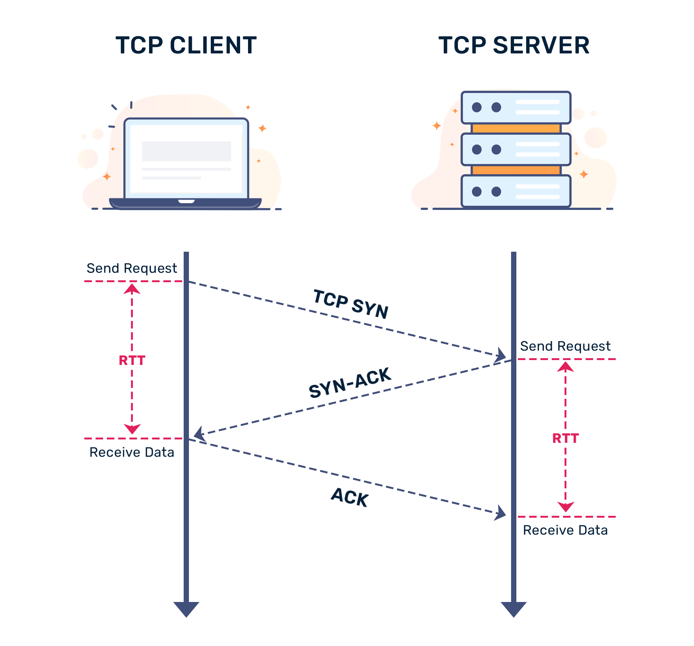
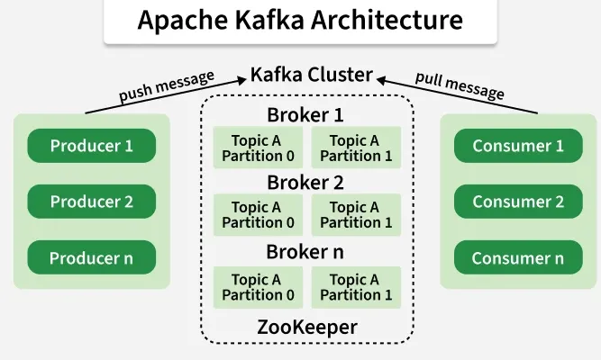
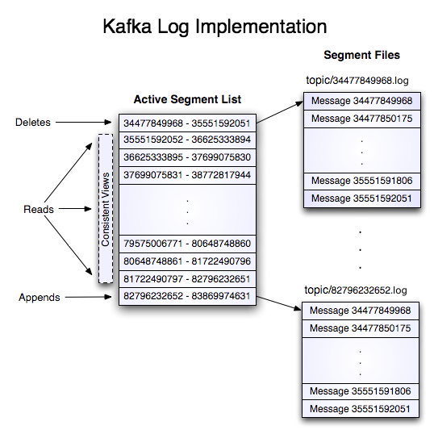

# Phân tích chuyên sâu Apache Kafka Paper 2011: Kiến trúc, Zero-Copy và Log-Structured Storage

Vào năm 2011 tại LinkedIn, ba kỹ sư **Jay Kreps**, **Neha Narkhede**, và **Jun Rao** đã công bố bài báo khoa học mang tính lịch sử: *"Kafka: a Distributed Messaging System for Log Processing"*. Công trình này đã khai sinh ra Apache Kafka — hệ thống phân tán xử lý luồng dữ liệu thời gian thực phổ biến nhất thế giới hiện nay.

Bài viết này sẽ đi sâu vào bối cảnh lịch sử, những hạn chế của các hệ thống Message Queue truyền thống và các quyết định kiến trúc đột phá tạo nên hiệu năng triệu tin nhắn mỗi giây của Kafka.

---

## 1. Bối cảnh ra đời: Giới hạn của các hệ thống Message Queue truyền thống

Trước khi Kafka xuất hiện, các hệ thống Message Queue doanh nghiệp như **IBM WebSphere MQ**, **RabbitMQ**, hoặc **ActiveMQ (JMS Specification)** thống trị thị trường. Tuy nhiên, khi LinkedIn phải xử lý hàng chục tỷ sự kiện hoạt động của người dùng (activity events, metrics, logs) mỗi ngày, các giải pháp truyền thống bộc lộ 4 điểm nghẽn nghiêm trọng:

### 1. Quá chú trọng vào các đảm bảo phân phối phức tạp (Heavy Delivery Guarantees)
- Các giải pháp như IBM WebSphere MQ hoặc JMS tập trung vào hỗ trợ giao dịch hai pha (2-phase commit, XA transactions) và xác nhận từng tin nhắn riêng lẻ (individual per-message ACK).
- Việc cho phép ACK rời rạc dẫn đến việc các tin nhắn bị tiêu thụ lộn xộn (out-of-order), đòi hỏi broker phải duy trì trạng thái đánh dấu rất phức tạp trong bộ nhớ.

### 2. Mỗi tin nhắn tiêu tốn trọn vẹn một vòng TCP Roundtrip
- Các hệ thống truyền thống gửi từng tin nhắn riêng lẻ qua mạng. Điều này làm tăng chi phí TCP/IP overhead và RTT (Round Trip Time).



> [!TIP]
> **Giải pháp của Kafka**: Áp dụng triệt để cơ chế gom nhóm dữ liệu (**Batching**) ngay tại phía Producer (`batch.size`, `linger.ms`). Thay vì gửi từng message rời rạc, Producer đóng gói hàng trăm tin nhắn vào một batch và gửi qua một lần TCP request duy nhất, giảm thiểu tối đa network overhead.

### 3. Hỗ trợ hệ thống phân tán (Distributed Support) rất yếu
- Các message queue truyền thống thường được thiết kế cho mô hình đơn máy chủ (scale-up) hoặc Active/Standby. Không có cơ chế phân vùng (**Partitioning**) tự nhiên để chia tải và lưu trữ dữ liệu đồng thời trên cụm hàng trăm máy chủ.

### 4. Giả định sai lầm về kích thước hàng đợi
- Hầu hết message broker truyền thống thiết kế với giả định rằng tin nhắn sẽ được Consumer tiêu thụ ngay lập tức, do đó hàng đợi trong RAM luôn nhỏ. Khi consumer bị chậm (lag), dữ liệu tràn ra đĩa cứng khiến hiệu năng broker tụt dốc thảm hại.
- **Kafka khắc phục điều này**: Kafka coi đĩa cứng là nơi lưu trữ chính từ đầu. Dù consumer đọc kịp thời hay chậm 7 ngày, hiệu năng đọc/ghi của broker vẫn duy trì ở mức hằng số $O(1)$.

---

## 2. Mô hình Pull vs Push: Quyền tự chủ cho Consumer

Một quyết định thiết kế then chốt của Kafka là lựa chọn mô hình **Pull (Kéo dữ liệu)** thay vì **Push (Đẩy dữ liệu)**:

| Tiêu chí | Push Model (RabbitMQ, ActiveMQ) | Pull Model (Apache Kafka) |
| :--- | :--- | :--- |
| **Bên điều khiển tốc độ** | Broker chủ động đẩy tin nhắn cho Consumer | Consumer chủ động gửi `fetch.min.bytes` để kéo |
| **Nguy cơ quá tải (Overwhelm)** | Dễ làm Consumer bị crash nếu tốc độ sản sinh dữ liệu tăng đột biến | Hoàn toàn loại bỏ; Consumer xử lý theo năng lực |
| **Khả năng Batching** | Khó gom batch ở phía Consumer | Tối ưu hóa tuyệt đối: Consumer pull một mẻ nhiều tin nhắn |
| **Khả năng đọc lại (Replay)** | Tin nhắn bị xóa ngay sau khi ACK | Lưu log bền vững; Consumer có thể reset offset để đọc lại |

---

## 3. Kiến trúc cốt lõi của Apache Kafka

Kiến trúc của Kafka được tổ chức theo cấp bậc rõ ràng, kết hợp giữa **Broker**, **Topic**, và **Partition** tạo thành cụm phân tán chịu lỗi cao.



### Các thành phần chính:
1. **Kafka Cluster & Broker**: Cụm gồm nhiều máy chủ Broker phối hợp với nhau.
2. **Topic & Partition**: Mỗi Topic được chia thành nhiều Partition độc lập. Partition chính là đơn vị mở rộng (scalability) và song song hóa (parallelism) của Kafka.
3. **Producer**: Ứng dụng xuất bản dữ liệu, phân chia record vào các partition bằng cơ chế Key Hashing hoặc Round-Robin.
4. **Consumer & Consumer Group**: Nhóm các consumer chia sẻ việc đọc các partition, đảm bảo mỗi partition chỉ được đọc bởi một consumer trong cùng group tại một thời điểm.

---

## 4. Tối ưu hóa hiệu năng đỉnh cao: Log-Structured IO & Zero-Copy

Làm thế nào mà Kafka có thể đạt thông lượng hàng triệu tin nhắn mỗi giây trên phần cứng thông thường? Câu trả lời nằm ở 3 kỹ thuật I/O đột phá:

### 1. Chuyển đổi Random I/O thành Sequential I/O với Offset
Kafka tổ chức partition dưới dạng một **Append-Only Commit Log** được chia nhỏ thành các file Segment (.log và .index).



- Mỗi tin nhắn mới được ghi tuần tự vào cuối log (Append-only) và gán một số định danh tăng dần gọi là `offset`.
- **Sequential Disk I/O**: Tốc độ ghi tuần tự vào ổ đĩa cơ HDD/SSD có thể đạt hàng trăm MB/s, nhanh hơn hàng nghìn lần so với việc truy xuất ngẫu nhiên (Random Disk I/O).

---

### 2. Tận dụng Linux OS Page Cache thay vì JVM Memory
Thay vì duy trì cache trong bộ nhớ heap của JVM (vốn dễ gây ra tình trạng Garbage Collection Pause kéo dài và tốn gấp đôi bộ nhớ do object overhead), Kafka để hệ điều hành Linux quản lý cache thông qua **Page Cache**:
- Mọi thao tác ghi của Producer trước hết được ghi vào OS Page Cache.
- Broker không gọi `fsync()` ngay lập tức sau mỗi tin nhắn mà dựa vào cơ chế nhân bản (**Replication**) sang các Broker ISR (In-Sync Replicas) để đảm bảo độ an toàn dữ liệu (Durability).
- Khi Consumer đọc tin nhắn vừa được ghi, dữ liệu được phục vụ trực tiếp từ Page Cache trong RAM mà không cần chạm tới đĩa cứng vật lý.

---

### 3. Tối ưu hóa Zero-Copy qua Linux `sendfile()` System Call

Ở các hệ thống truyền thống, việc đọc dữ liệu từ đĩa và gửi qua mạng cho Consumer phải trải qua **4 lần sao chép dữ liệu** và **4 lần chuyển đổi ngữ cảnh (Context Switches)** giữa User Space và Kernel Space:

```
[Traditional Data Path]:
1. Disk -> OS Page Cache (DMA Copy)
2. OS Page Cache -> Application Buffer (CPU Copy, Context Switch to User Space)
3. Application Buffer -> Socket Buffer (CPU Copy, Context Switch to Kernel Space)
4. Socket Buffer -> NIC Buffer (DMA Copy)
```

Kafka loại bỏ hoàn toàn sự lãng phí này trên đường dẫn Consumer Fetch bằng cách sử dụng **Java NIO `FileChannel.transferTo()`**, ánh xạ trực tiếp đến lệnh hệ thống **`sendfile()`** của Linux:

```
[Kafka Zero-Copy Path via sendfile()]:
1. Disk -> OS Page Cache (DMA Copy)
2. OS Page Cache -> NIC (Network Card) Buffer trực tiếp (DMA Copy via Scatter-Gather)
```

> [!IMPORTANT]
> **Lợi ích của Zero-Copy**:
> - Loại bỏ hoàn toàn CPU copy giữa Kernel Space và JVM User Space.
> - Tiết kiệm chu kỳ xử lý CPU và giảm thiểu triệt để độ trễ mạng khi phục vụ hàng chục ngàn Consumer đồng thời.

---

## 5. Tổng kết

Bài báo năm 2011 của LinkedIn đã đặt nền móng vững chắc cho sự bùng nổ của kiến trúc hướng sự kiện (Event-Driven Architecture). Bằng cách:
1. Đơn giản hóa cơ chế ACK thông qua **Sequential Offset Log**,
2. Gom nhóm tin nhắn (**Batching**) ở cả Producer và Consumer,
3. Tận dụng tối đa **Linux Page Cache** và kỹ thuật **Zero-Copy `sendfile`**,

Kafka đã chứng minh rằng một hệ thống lưu trữ bền vững trên đĩa cứng vẫn có thể đạt hiệu năng vượt trội hơn các hệ thống message queue thuần in-memory.

---
*Tham khảo thêm bài viết chi tiết về Zero-Copy:* [Hiểu sâu về Zero-Copy trong Hệ điều hành](https://thoainguyen.github.io/2019-04-18-zero-copy/)

    