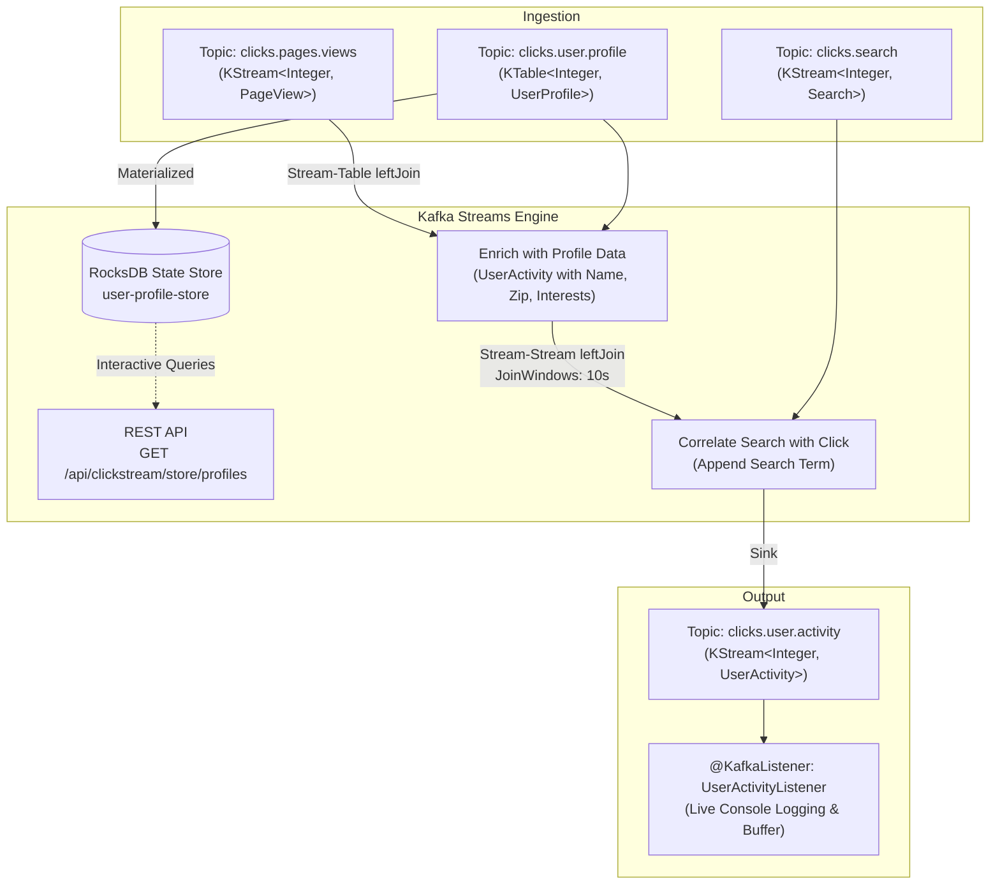

# Spring Boot Kafka Streams Clickstream Enrichment

A modern Spring Boot 3 implementation of the Kafka Streams clickstream enrichment pipeline, cloned and adapted from [gwenshap/kafka-clickstream-enrich](https://github.com/gwenshap/kafka-clickstream-enrich.git).

---

## 1. Overview & Architecture

This application joins three distinct Kafka data streams/tables to produce a real-time, unified 360° view of user activities on an e-commerce platform:

1. **`clicks.pages.views` (`KStream<Integer, PageView>`)**: Real-time event stream of page clicks and product views.
2. **`clicks.user.profile` (`KTable<Integer, UserProfile>`)**: Changelog stream of user demographic profiles (User ID, name, zipcode, interests), materialized directly into a local **RocksDB** state store (`user-profile-store`).
3. **`clicks.search` (`KStream<Integer, Search>`)**: Real-time stream of user search queries.
4. **`clicks.user.activity` (`KStream<Integer, UserActivity>`)**: Output topic containing enriched user activity records.



---

## 2. Key Features

1. **Stream-Table Left Join**:
   - Matches incoming page views with user profiles using User ID as the key.
   - Profile updates are immediately reflected without service restart.
   - If a user is unregistered or anonymous (`userId = -1`), attributes default safely (`Anonymous`, `zipcode = N/A`).

2. **Stream-Stream Windowed Left Join**:
   - Matches page views with search queries performed by the same user within a temporal window (default: 10 seconds).
   - Answers critical analytics questions like: *"Which search terms led to which product clicks?"*

3. **Interactive State Store Queries (RocksDB)**:
   - The user profile `KTable` is materialized in RocksDB.
   - Spring Boot exposes read-only interactive queries over HTTP (`GET /api/clickstream/store/profiles/{userId}`) without hitting external databases or rescanning Kafka topics.

4. **Automated Topic Provisioning**:
   - Topics (`clicks.user.profile`, `clicks.pages.views`, `clicks.search`, `clicks.user.activity`) are automatically created with 3 partitions and replication factor 3.

5. **Gwen Shapira Scenario Generator & Mock Traffic Simulator**:
   - Execute the exact sample scenario from the original repository with one click/endpoint (`POST /api/clickstream/sample`).
   - Toggle background continuous mock traffic generation (`POST /api/clickstream/generator/toggle`).

6. **Spring Kafka Listener**:
   - Automatically consumes from `clicks.user.activity` and outputs enriched activity logs to the console in real time.

---

## 3. Prerequisites

Start the Kafka cluster defined in `docker-compose.yml`:
```bash
docker compose up -d
```
Verify the brokers are up on `localhost:9092,localhost:9093,localhost:9094`.

---

## 4. How to Run

### In IntelliJ IDEA:
1. Open or import `spring-kafka-clickstream-enrich` as a Maven project.
2. Run `SpringKafkaClickstreamEnrichApplication` using the green Play button.
3. The server starts on port `8083`.

### Using Maven:
```bash
mvn spring-boot:run
```

---

## 5. REST Endpoints & Verification

### Check Application & Streams Status
```bash
curl http://localhost:8083/api/clickstream/status
```

### Trigger the Gwen Shapira Demo Dataset
Replays 2 user profiles, a profile update, 3 search queries, 5 page views, and 1 anonymous page view:
```bash
curl -X POST http://localhost:8083/api/clickstream/sample
```

### View Enriched Output Activities
```bash
curl http://localhost:8083/api/clickstream/activities
```

### Interactive Queries on RocksDB State Store
Fetch all profiles currently held in RocksDB:
```bash
curl http://localhost:8083/api/clickstream/store/profiles
```

Fetch a specific profile (e.g. user `2`):
```bash
curl http://localhost:8083/api/clickstream/store/profiles/2
```

### Ingest Custom Events

**1. Create or update a profile:**
```bash
curl -X POST http://localhost:8083/api/clickstream/profile \
  -H "Content-Type: application/json" \
  -d '{
    "userId": 10,
    "userName": "Alice",
    "zipcode": "98101",
    "interests": ["Kafka", "Distributed Systems"]
  }'
```

**2. Send a search query:**
```bash
curl -X POST http://localhost:8083/api/clickstream/search \
  -H "Content-Type: application/json" \
  -d '{
    "userId": 10,
    "searchTerms": "apache kafka architecture book"
  }'
```

**3. Send a page view (within 10s of the search):**
```bash
curl -X POST http://localhost:8083/api/clickstream/pageview \
  -H "Content-Type: application/json" \
  -d '{
    "userId": 10,
    "page": "books/software/designing-data-intensive-applications"
  }'
```

---

## 6. Postman Collection

Import the included collection into Postman:
- File location: `postman/Spring_Kafka_Clickstream_Enrich.postman_collection.json` (also in repository root `postman/Spring_Kafka_Clickstream_Enrich.postman_collection.json`)
- Base URL variable: `{{baseUrl}}` (defaults to `http://localhost:8083`)
