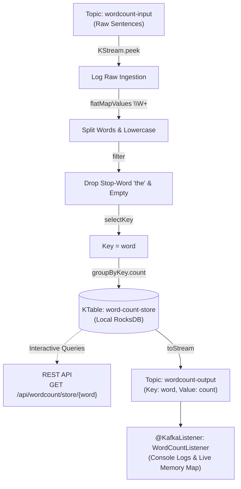

# Spring Boot Kafka Streams WordCount

A modern Spring Boot 3 implementation of the classic Kafka Streams WordCount example, cloned and adapted from [gwenshap/kafka-streams-wordcount](https://github.com/gwenshap/kafka-streams-wordcount.git).

---

## 1. Overview & Architecture

This application processes unstructured text streams in real-time to compute live word counts:

1. **`wordcount-input` (`KStream<String, String>`)**: Ingests raw sentences and text messages.
2. **Text Processing**:
   - Splits incoming text into lowercase tokens using regex `\W+` (ignoring punctuation).
   - Filters empty words.
   - Filters out the stop-word **"the"** (configurable via `app.kafka.stop-word`).
3. **Stateful KTable Aggregation**:
   - Re-keys the stream by word (`selectKey`).
   - Groups by word (`groupByKey`).
   - Aggregates counts statefully into a local **RocksDB** state store (`word-count-store`).
4. **`wordcount-output` (`KStream<String, Long>`)**: Emits word count updates to the output topic.



---

## 2. Key Features

1. **Stateful Stream Aggregation (KTable)**:
   - Demonstrates the foundational Kafka Streams pattern: `KStream` $\rightarrow$ `groupByKey` $\rightarrow$ `count()` $\rightarrow$ `KTable`.
   - Backed by an embedded **RocksDB** database on disk (`./data/kafka-streams/wordcount`).
2. **Interactive Queries (RocksDB)**:
   - Exposes REST endpoints to query words directly from the embedded state store over HTTP without scanning Kafka topics.
3. **Stop-Word Filtering**:
   - Excludes common words like "the" from being tracked in the word count state store.
4. **Auto-Topic Provisioning**:
   - Topics (`wordcount-input`, `wordcount-output`) are auto-created on startup with 3 partitions and replication factor 3.
5. **Spring Kafka Listener**:
   - Consumes the output topic and maintains an in-memory live map accessible via REST API.

---

## 3. Prerequisites

Start the local Kafka cluster (if not already running):
```bash
docker compose up -d
```
Verifies brokers are available on `localhost:9092,localhost:9093,localhost:9094`.

---

## 4. How to Run

### In IntelliJ IDEA:
1. Open or import `spring-kafka-wordcount` as a Maven project.
2. Run `SpringKafkaWordCountApplication` using the green Play button.
3. The application starts on port `8084` (no port conflict with existing projects).

### Using Maven:
```bash
cd spring-kafka-wordcount
mvn spring-boot:run
```

---

## 5. REST Endpoints & Examples

### Check Application & Streams Status
```bash
curl http://localhost:8084/api/wordcount/status
```

### Publish Sample Sentences
Publishes sample sentences with repeated words and stop-words:
```bash
curl -X POST http://localhost:8084/api/wordcount/sample
```

### Publish Custom Text
```bash
curl -X POST http://localhost:8084/api/wordcount/publish \
  -H "Content-Type: application/json" \
  -d '{"text":"Kafka streams processing real time text streams! Kafka streams is fast and powerful."}'
```

### Query Live Counts from Consumer
```bash
curl http://localhost:8084/api/wordcount/counts
```

### Query Local RocksDB State Store Directly
**Fetch all words from RocksDB:**
```bash
curl http://localhost:8084/api/wordcount/store
```

**Fetch the exact count for a single word (e.g. `kafka`):**
```bash
curl http://localhost:8084/api/wordcount/store/kafka
```

---

## 6. Postman Collection

Import the included collection into Postman:
- File location: `postman/Spring_Kafka_WordCount.postman_collection.json` (also in repository root `postman/Spring_Kafka_WordCount.postman_collection.json`)
- Base URL variable: `{{baseUrl}}` (defaults to `http://localhost:8084`)
